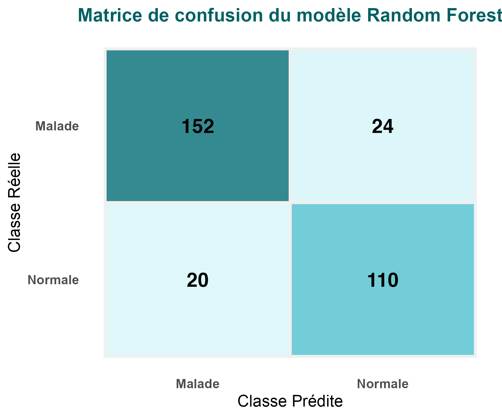
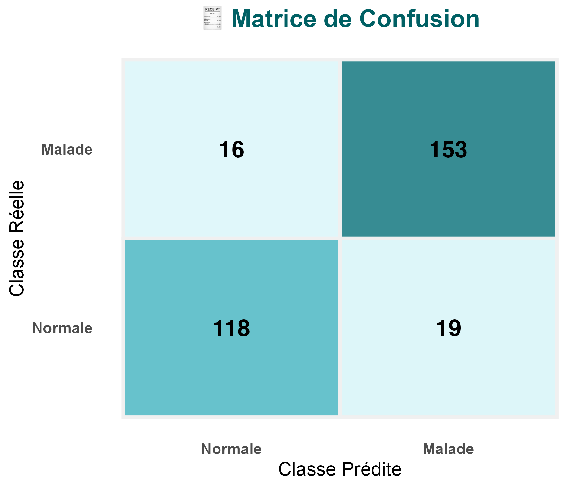
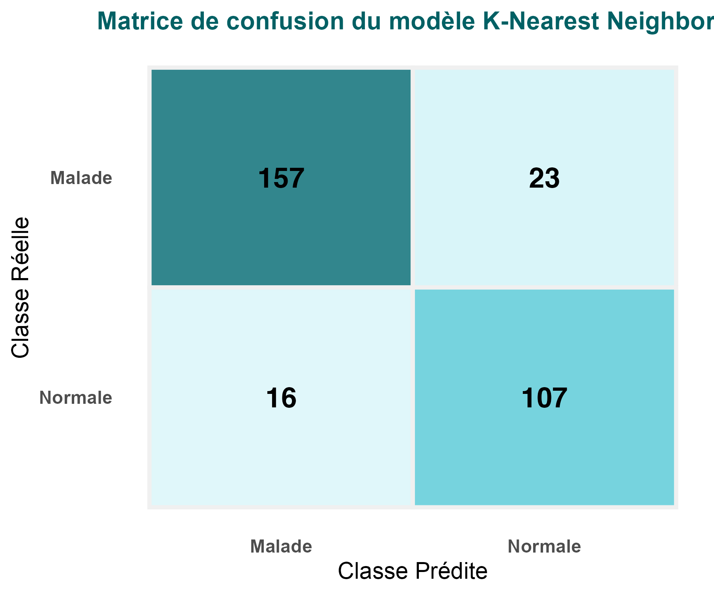

# Préambule concernant la remise du projet

Pour la remise du projet, il s'agit d'envoyer un mail à RB lorsque votre projet GitLab sera finalisé.

**Pour l'évaluation, c'est le rapport de projet qui va compter le plus. Le reste de ce qui se trouve sur votre projet GitLab pourra éventuellement servir pour des éclaircissements lorsque ce n'est pas suffisamment clair dans le rapport.** 

Le rapport consiste en un fichier Markdown et devra remplacer ce README.

Bien qu'au format markdown, il est attendu un vrai rapport de projet : similaire à **un rapport** de stage et **devant se suffire à lui-même**, c'est-à-dire qu'il n'est pas nécessaire d'aller fouiller ailleurs dans votre projet GitLab pour comprendre ce qui a été fait, pourquoi, comment, pour quels résultats, quelles conclusions et quelles perspectives.

Points à vérifier avant la remise finale :

  * **Nettoyage :** supprimer tous les fichiers et répertoires qui ne sont pas nécessaires dans l'ensemble de votre projet GitLab afin qu'il ne reste que les informations utiles et pertinentes.
  * **Rapport :** vérifier que le rapport est bien présent dans ce répertoire et s'affiche correctement.
  * **Page d'accueil :** suggestion → ne laisser qu'une courte accroche sur la teneur de votre projet et mettre un lien vers le rapport

**Remarques :** 

  * il n'est pas impossible que vous utilisiez ultérieurement votre projet GitLab de fouille de données afin de mettre en valeur votre parcours pour soutenir une candidature à un poste.
  * pensez à utiliser le correcteur d'orthographe et/ou vous faire relire par quelqu'un d'autre
  * un rapport de projet ne contient en général pas de code, il faut plutôt décrire le(s) concept(s) et renvoyer éventuellement aux scripts qui seraient dans des annexes (« ce que l'on conçoit bien s'énonce clairement, et les mots pour le dire arrivent aisément », Nicolas Boileau)

# Contexte

Une brêve introduction sur le contexte (par exemple les systèmes ABC) et les objectifs clairs du projet : quelle question est posée.

# Analyse

Donnez des précisions sur les objectifs à atteindre et comment y arriver. 

Effectuez une ou des analyses préliminaires des données pour les appréhender ainsi que les méthodes disponibles pour atteindre les objectifs.

# Conception

Fort de l'analyse précedente, présenter l'approche choisie et pourquoi. 

Ensuite, présenter quelle méthodologie vous allez mettre en oeuvre pour les différentes étapes du projet avec quelles méthodes :

  * Tout d'abord, présenter comment va être obtenue la matrice individus-variables+classes (sélection, transformation, nettoyage, ...)
  * Puis, comment elle va être utilisée pour produire des résultats (par exemple : quelle(s) méthode(s) de classification ou de clustering)
  * Enfin, quelle méthodologie sera mise en oeuvre pour l'évaluation des résultats obtenus (quelles mesures ou indicateurs pour évaluer quoi)

# Réalisation

Mise en oeuvre de ce qui a été conçu : il s'agit là de préciser les paramètres et tous les détails concernant la réalisation concrète de l'analyse. 

Inclure ensuite les résultats obtenus et/ou leur synthèse s'ils sont trop nombreux pour le format d'un rapport de projet.

# Discussion

Analyse et discussion sur les résultats obtenus. 

Conclusions sur la qualité de la ou des méhtodes mises en oeuvre.

# Bilan et perspectives

Qu'est-ce qui fonctionne ou pas. 

Pistes d'amélioration. 

Recul sur l'ensemble du projet et votre manière de l'aborder et de le réaliser. 

Si c'était à refaire... ou bien, quelles pourraient être les pistes d'investigation subséquentes ouvertes par les résultats obtenus ?

# Gestion du projet

* Comment s’est organisé le groupe.
* Comment se sont déroulées les discussions, les prises de décisions.
* Comment se sont réparties les tâches. Qui a fait quoi.
* Quels ont été les rôles et les contributions de chacun·e.
* Diagramme de Gantt avec le calendrier et les tâches.
* Section spéciale méthodologie de travail : Dans cette section, **vous devrez mentionner l'aide extérieure** que vous avez pu recevoir (d'autres étudiants ou connaissances) ou si vous avez travailler à plusieurs sur certaines parties du projet. **Vous devrez aussi mentionner l'utilisation ou la non utilisation de chatGPT** (ou autres IA) pour le code et/ou la rédaction.

# I. Introduction
## 1- Contexte
Les maladies cardiovasculaires (MCV) représentent la principale cause de mortalité à l’échelle mondiale, responsable d’environ 17,9 millions de décès chaque année, soit environ 31 % de tous les décès mondiaux (World Health Organization, 2021). La majorité de ces décès sont causés par des crises cardiaques et des accidents vasculaires cérébraux (AVC). Ces statistiques mettent en évidence l'importance d'une détection précoce des facteurs de risque pour prévenir l'apparition de ces événements graves. En effet, un tiers des décès liés aux MCV surviennent chez des personnes de moins de 70 ans, soulignant ainsi la nécessité d’une prise en charge précoce, notamment au sein des populations jeunes. Les principaux facteurs de risque des MCV incluent l’hypertension, l’hyperlipidémie, le diabète et des antécédents de maladies cardiaques. La combinaison de ces facteurs peut précipiter l'apparition de maladies cardiaques graves si elle n'est pas identifiée et gérée à temps (Benjamin et al., 2019). 
Dans ce contexte, l'utilisation de modèles d’apprentissage automatique (machine learning) pour prédire les risques de maladies cardiovasculaires devient de plus en plus populaire dans le domaine médical. Ces modèles permettent d'analyser de grandes quantités de données médicales et biologiques pour déterminer quels facteurs sont les plus influents dans la survenue des MCV (Byrsell et al., 2021; Rafi et al., 2022). L’objectif est de permettre un diagnostic plus rapide et précis, et d’améliorer le suivi des patients, tout en optimisant les traitements.
## 2- Objectif
L’objectif de ce projet est de tester différents algorithmes de classification pour prédire la présence de maladies cardiovasculaires à partir de données cliniques et biologiques. L’analyse sera menée en plusieurs étapes : d’abord, le prétraitement des données incluant le nettoyage et la normalisation des variables ; puis l’application et la comparaison de divers modèles de classification ; et enfin, l’évaluation des performances des modèles suivie d’une analyse des facteurs de risque majeurs. Ce travail s’inscrit dans une démarche de détection précoce des maladies cardiovasculaires, en vue de proposer des pistes d’amélioration pour la prévention et la gestion des risques.

# II.Préparation du jeu de données
La première étape de notre étude a consisté à préparer les données pour les rendre exploitables dans le cadre d’une modélisation par apprentissage automatique. Le processus a commencé par le chargement du jeu de données , réalisé via la fonction read_csv de R. Celui-ci contient des informations cliniques et biologiques relatives à 918 patients, avec une variable cible binaire HeartDisease indiquant la présence ou l’absence d’une maladie cardiovasculaire.
Afin de garantir la cohérence des traitements statistiques à venir, les variables textuelles ont été converties en facteurs. La variable cible, initialement codée en 0 (absence de maladie) et 1 (présence de maladie), a été renommée de manière plus explicite pour afficher les modalités « Normale » et « Malade », facilitant ainsi l’interprétation des résultats. Par ailleurs, un contrôle de qualité a été effectué : aucune valeur manquante (NA) n’a été détectée, ce qui nous a permis de travailler directement sur l’ensemble des données sans imputation.
Un examen des doublons a également été réalisé. Bien que le jeu de données d’origine mentionne l’existence de doublons (272 entrées dupliquées), dans notre cas, le fichier utilisé ne contenait pas de lignes identiques, ce qui a évité la nécessité d'une étape de dédoublonnage.
Toutes les variables disponibles dans l’ensemble de données ont été conservées pour l’analyse, car elles se sont révélées pertinentes à la fois d’un point de vue médical et statistique. Pour les variables numériques (Age, RestingBP, Cholesterol, MaxHR, Oldpeak), une visualisation exploratoire a été réalisée sous forme de diagrammes en boîte et de violons, permettant de comparer les distributions entre les variables numériques pour voir s’il y a une différence d’échelle.

**Figure 1:  Distribution des variables quantitatives selon la présence ou l’absence de maladie cardiaque (sans normalisation)**

Nous observons que les variables Age, et Oldpeak sont visuellement écrasées par les autres variables quantitatives en raison de différences d'échelles. Il est donc pertinent de normaliser. 
Les variables numériques ont donc été normalisées à l’aide du z-score, ce qui consiste à centrer et réduire chaque variable afin d’obtenir une moyenne nulle et un écart-type égal à un. Cette étape est essentielle pour garantir que toutes les variables sont comparables et qu’aucune ne domine les autres en raison de son échelle de mesure.

**Figure 2: Distribution des variables quantitatives selon la présence ou l’absence de maladie cardiaque ( après normalisation)**

Grâce à la normalisation par z-score, nous observons maintenant que toutes les variables sont désormais exprimées sur une échelle commune. Cela permet une comparaison plus équitable de leurs distributions entre les patients atteints ou non de maladies cardiovasculaires et cette étape est essentielle pour les algorithmes de classification automatique.
Une analyse de la matrice de corrélation a ensuite été menée pour évaluer les relations linéaires entre les variables quantitatives. L’objectif était de détecter d’éventuelles redondances. Les résultats ont montré que les corrélations entre variables restaient relativement faibles (aucune au-dessus de 0,8), ce qui signifie que chaque variable apporte une information complémentaire, et qu’il n’était pas nécessaire d’en supprimer.
Du côté des variables qualitatives (Sex, ChestPainType, RestingECG, ExerciseAngina, ST_Slope, FastingBS), une exploration de leur distribution selon la présence ou non de maladie cardiaque a également été réalisée, comme le montre la figure 3 ci-dessous. Cette analyse montre que l’ensemble des variables qualitatives étudiées sont potentiellement informatives, car elles permettent de distinguer de manière nette les groupes de patients malades et non malades. 

**Figure 3: Distribution des variables qualitatives selon la présence ou l’absence de maladie cardiaque**

Des tests du chi² ont ensuite été appliqués pour déterminer si elles sont statistiquement liées à la présence d’une maladie cardiaque. Les résultats ont indiqué que toutes les variables catégorielles sont significativement associées à la variable cible (p-value < 0,05 dans tous les cas), ce qui justifie pleinement leur intégration dans la suite de l’analyse.
Enfin, les données ont été consolidées dans une table propre, nommée tb_final dans notre script R. Elle représente une matrice individus-variables complète, sans doublons ni valeurs manquantes, avec des variables quantitatives normalisées et des variables qualitatives pertinentes. Ce jeu de données structuré est désormais prêt pour les étapes suivantes d’entraînement et d’évaluation des modèles de classification.

# III.Mise en place des modèles de classification
L’objectif principal de cette étape est de construire des modèles prédictifs permettant de déterminer si un individu est atteint ou non d’une maladie cardiovasculaire, à partir de ses caractéristiques cliniques et biologiques. Pour ce faire, nous avons opté pour des techniques d’apprentissage supervisé, qui consistent à entraîner un modèle sur un ensemble de données étiquetées (dont la variable cible est connue), afin qu’il puisse ensuite prédire cette variable sur de nouveaux cas.

Dans le cadre de cette étude, quatre algorithmes de classification ont été implémentés : la Forêt aléatoire (Random Forest), qui repose sur un ensemble d’arbres de décision, le classificateur Naïve Bayes, fondé sur les principes de probabilité bayésienne, l’algorithme des k-plus proches voisins (k-Nearest Neighbors, KNN), une méthode intuitive et non paramétrique, qui classe un individu en fonction des classes majoritaires de ses voisins les plus proches dans l’espace des attributs, et enfin l'Arbre de Décision, une approche hiérarchique qui divise l’espace des caractéristiques en sous-groupes homogènes pour effectuer des prédictions. Ces modèles ont été sélectionnés pour leur complémentarité théorique et leur popularité dans les applications biomédicales : Random Forest pour sa capacité à capturer des interactions complexes entre variables, Naïve Bayes pour sa rapidité d’apprentissage et sa lisibilité, KNN pour son approche fondée uniquement sur la distance, et l'Arbre de Décision pour sa simplicité d'interprétation et son efficacité dans des situations de classification claires.

Afin d’évaluer les performances des modèles dans des conditions proches de la réalité, une séparation du jeu de données a été réalisée. Nous avons appliqué un partitionnement aléatoire stratifié, de manière à répartir les individus dans les deux sous-ensembles (2/3 pour l'entraînement, 1/3 pour le test) tout en maintenant les proportions des classes (malade / non-malade) équilibrées dans chaque groupe.

## 1- Modèle 1 : Forêt Aléatoire (Random Forest)

Le modèle Random Forest a été entraîné à l’aide de la fonction randomForest() du package R correspondant, avec un nombre standard de 500 arbres de décision (paramètre ntree = 500). Ce choix permet un bon compromis entre précision, temps de calcul et complexité du modèle. La Forêt Aléatoire génère chaque arbre à partir d’un sous-échantillon aléatoire du jeu de données et sélectionne à chaque nœud un sous-ensemble de variables, ce qui en fait un modèle robuste face à la suradaptation et aux corrélations entre variables.
À l’issue de l’apprentissage, les prédictions sur le jeu de test ont permis d’évaluer les performances de manière objective. Le modèle affiche une précision globale (accuracy) de 86,6 %, indiquant que plus de huit individus sur dix ont été correctement classés. L’indice Kappa atteint 0,7267, ce qui correspond à un accord substantiel entre les prédictions du modèle et les étiquettes réelles. Le modèle montre une sensibilité de 89,53 %, c’est-à-dire qu’il détecte correctement près de 9 malades sur 10, ce qui est crucial pour une application médicale où les faux négatifs sont coûteux. La spécificité atteint 82,84 %, assurant également une bonne capacité à identifier les individus sains.
Les valeurs prédictives positives et négatives sont respectivement de 87,01 % et 86,05 %, ce qui traduit un bon équilibre dans la fiabilité du modèle sur les deux classes. La balanced accuracy, moyenne de la sensibilité et de la spécificité, est de 86,19 %, confirmant la stabilité du modèle, même dans le cas de classes légèrement déséquilibrées.

**Tableau 1 : Matrice de confusion du modèle Random Forest avec ntree = 500**

Ce premier modèle constitue une base solide pour la suite de l’étude. Il sera par la suite affiné par des ajustements de paramètres et éventuellement comparé à d’autres approches, mais ses performances initiales confirment son potentiel élevé pour ce type de tâche.

## 2- Modèle 2 : Naïve Bayes
Le deuxième modèle exploré dans cette étude est le classifieur Naïve Bayes, implémenté à l’aide de la fonction naiveBayes() du package e1071. Ce type de modèle repose sur une approche probabiliste dérivée du théorème de Bayes, qui suppose que les variables explicatives sont conditionnellement indépendantes entre elles, étant donné la variable cible. Bien que cette hypothèse d’indépendance soit souvent violée dans les jeux de données réels, elle permet de construire des modèles efficaces, simples et rapides à entraîner.
À l’issue de la phase d’apprentissage, les prédictions sur l’échantillon de test ont révélé une performance particulièrement remarquable du modèle. Le taux de précision globale (accuracy) atteint 88,56 %, ce qui témoigne d'une excellente capacité de classification sur des données jamais vues. Cette précision est accompagnée d’un intervalle de confiance à 95 % compris entre 84,45 % et 91,90 %, traduisant une grande stabilité statistique du modèle.

L’indice Kappa, égal à 0,7682, indique un fort accord entre les prédictions et la vérité terrain, bien supérieur au simple hasard. Le modèle parvient à détecter 88,95 % des individus réellement malades (sensibilité) tout en identifiant correctement 88,06 % des individus en bonne santé (spécificité). Cette symétrie entre les deux indicateurs montre que le modèle n’est pas biaisé en faveur d’une classe au détriment de l’autre.
En termes d’utilité clinique, la valeur prédictive positive (PPV) s’élève à 90,53 %, ce qui signifie que plus de 9 individus sur 10 prédits comme malades le sont effectivement. La valeur prédictive négative (NPV) atteint 86,13 %, assurant aussi une fiabilité importante lorsqu’un patient est classé comme sain. Enfin, la balanced accuracy, qui mesure la moyenne entre la sensibilité et la spécificité, est de 88,51 %, un score élevé qui confirme la robustesse du classifieur, même en présence de classes légèrement déséquilibrées.

**Tableau 2 : Matrice de confusion du modèle Naïve Bayes (accuracy = 88,56 %)]**

Ces résultats montrent qu’en dépit de la simplicité des hypothèses qui le sous-tendent, le modèle Naïve Bayes peut s'avérer extrêmement performant. Sa rapidité d'exécution, son interprétabilité intuitive, et sa capacité à fournir des probabilités explicites font de lui un candidat particulièrement adapté aux problématiques biomédicales, où la lisibilité des décisions est aussi importante que la performance brute.

## 3-  Modèle 3 : k-Nearest Neighbors (KNN)

Le troisième modèle exploré dans cette étude est l'algorithme des k-plus proches voisins (KNN). Ce modèle est une approche non paramétrique et basée sur la distance, utilisée pour classer un individu en fonction des classes majoritaires de ses k voisins les plus proches dans l'espace des caractéristiques. Dans cette étude, nous avons utilisé k = 5, ce qui signifie que chaque prédiction repose sur les 5 voisins les plus proches d’un individu dans l’ensemble des données d’entraînement. L’un des grands avantages de ce modèle est l’absence de phase d’entraînement proprement dite : il se contente de mémoriser l’ensemble d’entraînement et effectue des prédictions à partir de cette base. Le modèle KNN est particulièrement apprécié pour sa simplicité et son approche intuitive, ne nécessitant aucun paramètre complexe et étant facilement interprétable, ce qui est un atout considérable dans un contexte biomédical.
Après l’entraînement du modèle et l'évaluation sur l’échantillon de test, les performances ont été mesurées à l’aide de plusieurs indicateurs. La précision globale (accuracy) a atteint 87,02 %, ce qui signifie que 87,02 % des individus ont été correctement classés. Cette précision montre que le modèle est fiable et efficace pour effectuer des prédictions sur des données inconnues. L’indice Kappa, qui mesure l’accord entre les prédictions et les étiquettes réelles, a atteint 0,7355, ce qui correspond à un accord substantiel, bien au-delà du simple hasard. Le modèle a également montré une sensibilité de 87,22 %, indiquant qu’il a correctement détecté près de 9 individus malades sur 10. Cette performance est cruciale dans un cadre médical, où il est essentiel de minimiser les faux négatifs, qui peuvent entraîner de graves conséquences. La spécificité du modèle, qui mesure la capacité à identifier correctement les individus sains, a atteint 86,72 %, indiquant également de bonnes performances dans la détection des individus en bonne santé.
La précision (ou valeur prédictive positive) a été de 91,15 %, ce qui signifie que parmi les individus classés comme malades par le modèle, 91,15 % étaient effectivement malades. Ce chiffre indique une forte fiabilité dans la prédiction des individus malades. En termes de rappel, qui est équivalent à la sensibilité dans ce cas, le modèle a également obtenu un score de 87,22 %, montrant qu’il a bien détecté la majorité des individus réellement malades. Le F1-score, qui combine la précision et le rappel en une seule mesure harmonique, a atteint 0,89, témoignant du bon compromis du modèle entre ces deux critères.

**Tableau 3 : Matrice de confusion du modèle K-Nearest Neighbors (k = 5)**

Enfin le modèle K-Nearest Neighbors (KNN) a démontré des performances solides et cohérentes, le rendant ainsi fiable pour la classification des maladies cardiovasculaires. Il s'est avéré capable de détecter efficacement les individus malades tout en maintenant une bonne précision dans l'identification des individus sains. Sa simplicité et son efficacité en font une méthode particulièrement pertinente pour les applications médicales, où des décisions rapides et précises sont essentielles.

