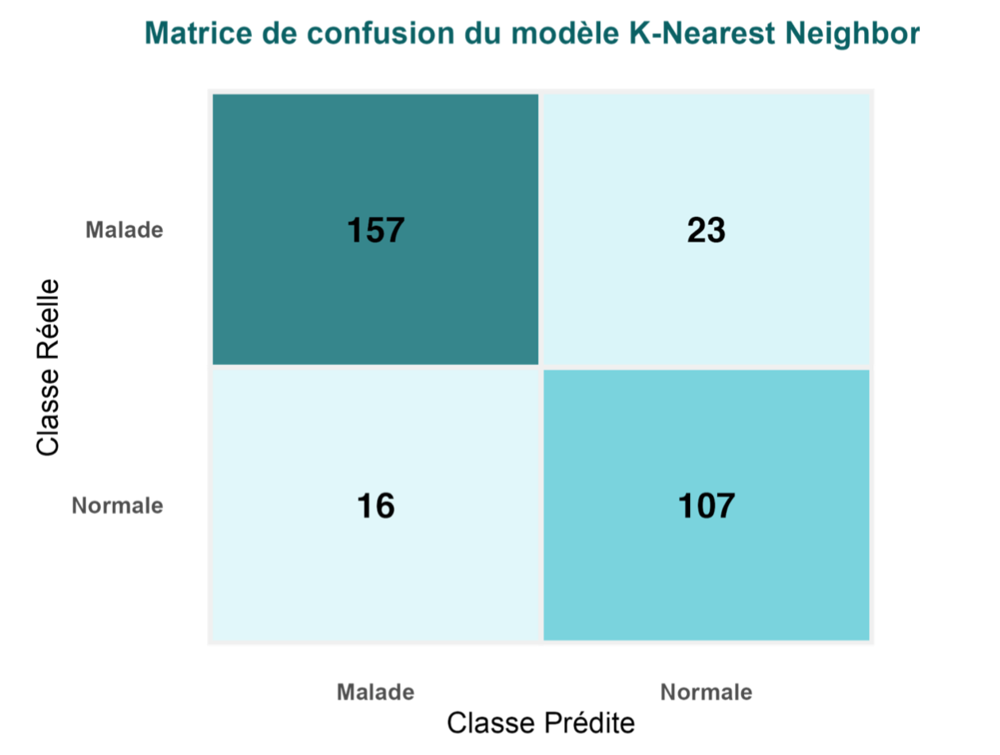

# Préambule concernant la remise du projet

Pour la remise du projet, il s'agit d'envoyer un mail à RB lorsque votre projet GitLab sera finalisé.

**Pour l'évaluation, c'est le rapport de projet qui va compter le plus. Le reste de ce qui se trouve sur votre projet GitLab pourra éventuellement servir pour des éclaircissements lorsque ce n'est pas suffisamment clair dans le rapport.** 

Le rapport consiste en un fichier Markdown et devra remplacer ce README.

Bien qu'au format markdown, il est attendu un vrai rapport de projet : similaire à **un rapport** de stage et **devant se suffire à lui-même**, c'est-à-dire qu'il n'est pas nécessaire d'aller fouiller ailleurs dans votre projet GitLab pour comprendre ce qui a été fait, pourquoi, comment, pour quels résultats, quelles conclusions et quelles perspectives.

Points à vérifier avant la remise finale :

  * **Nettoyage :** supprimer tous les fichiers et répertoires qui ne sont pas nécessaires dans l'ensemble de votre projet GitLab afin qu'il ne reste que les informations utiles et pertinentes.
  * **Rapport :** vérifier que le rapport est bien présent dans ce répertoire et s'affiche correctement.
  * **Page d'accueil :** suggestion → ne laisser qu'une courte accroche sur la teneur de votre projet et mettre un lien vers le rapport

**Remarques :** 

  * il n'est pas impossible que vous utilisiez ultérieurement votre projet GitLab de fouille de données afin de mettre en valeur votre parcours pour soutenir une candidature à un poste.
  * pensez à utiliser le correcteur d'orthographe et/ou vous faire relire par quelqu'un d'autre
  * un rapport de projet ne contient en général pas de code, il faut plutôt décrire le(s) concept(s) et renvoyer éventuellement aux scripts qui seraient dans des annexes (« ce que l'on conçoit bien s'énonce clairement, et les mots pour le dire arrivent aisément », Nicolas Boileau)

# Contexte

Une brêve introduction sur le contexte (par exemple les systèmes ABC) et les objectifs clairs du projet : quelle question est posée.

# Analyse

Donnez des précisions sur les objectifs à atteindre et comment y arriver. 

Effectuez une ou des analyses préliminaires des données pour les appréhender ainsi que les méthodes disponibles pour atteindre les objectifs.

# Conception

Fort de l'analyse précedente, présenter l'approche choisie et pourquoi. 

Ensuite, présenter quelle méthodologie vous allez mettre en oeuvre pour les différentes étapes du projet avec quelles méthodes :

  * Tout d'abord, présenter comment va être obtenue la matrice individus-variables+classes (sélection, transformation, nettoyage, ...)
  * Puis, comment elle va être utilisée pour produire des résultats (par exemple : quelle(s) méthode(s) de classification ou de clustering)
  * Enfin, quelle méthodologie sera mise en oeuvre pour l'évaluation des résultats obtenus (quelles mesures ou indicateurs pour évaluer quoi)

# Réalisation

Mise en oeuvre de ce qui a été conçu : il s'agit là de préciser les paramètres et tous les détails concernant la réalisation concrète de l'analyse. 

Inclure ensuite les résultats obtenus et/ou leur synthèse s'ils sont trop nombreux pour le format d'un rapport de projet.

# Discussion

Analyse et discussion sur les résultats obtenus. 

Conclusions sur la qualité de la ou des méhtodes mises en oeuvre.

# Bilan et perspectives

Qu'est-ce qui fonctionne ou pas. 

Pistes d'amélioration. 

Recul sur l'ensemble du projet et votre manière de l'aborder et de le réaliser. 

Si c'était à refaire... ou bien, quelles pourraient être les pistes d'investigation subséquentes ouvertes par les résultats obtenus ?

# Gestion du projet

* Comment s’est organisé le groupe.
* Comment se sont déroulées les discussions, les prises de décisions.
* Comment se sont réparties les tâches. Qui a fait quoi.
* Quels ont été les rôles et les contributions de chacun·e.
* Diagramme de Gantt avec le calendrier et les tâches.
* Section spéciale méthodologie de travail : Dans cette section, **vous devrez mentionner l'aide extérieure** que vous avez pu recevoir (d'autres étudiants ou connaissances) ou si vous avez travailler à plusieurs sur certaines parties du projet. **Vous devrez aussi mentionner l'utilisation ou la non utilisation de chatGPT** (ou autres IA) pour le code et/ou la rédaction.

# I. Introduction
## 1- Contexte
Les maladies cardiovasculaires (MCV) représentent la principale cause de mortalité à l’échelle mondiale, responsable d’environ 17,9 millions de décès chaque année, soit environ 31 % de tous les décès mondiaux (World Health Organization, 2021). La majorité de ces décès sont causés par des crises cardiaques et des accidents vasculaires cérébraux (AVC). Ces statistiques mettent en évidence l'importance d'une détection précoce des facteurs de risque pour prévenir l'apparition de ces événements graves. En effet, un tiers des décès liés aux MCV surviennent chez des personnes de moins de 70 ans, soulignant ainsi la nécessité d’une prise en charge précoce, notamment au sein des populations jeunes. Les principaux facteurs de risque des MCV incluent l’hypertension, l’hyperlipidémie, le diabète et des antécédents de maladies cardiaques. La combinaison de ces facteurs peut précipiter l'apparition de maladies cardiaques graves si elle n'est pas identifiée et gérée à temps (Benjamin et al., 2019). 
Dans ce contexte, l'utilisation de modèles d’apprentissage automatique (machine learning) pour prédire les risques de maladies cardiovasculaires devient de plus en plus populaire dans le domaine médical. Ces modèles permettent d'analyser de grandes quantités de données médicales et biologiques pour déterminer quels facteurs sont les plus influents dans la survenue des MCV (Byrsell et al., 2021; Rafi et al., 2022). L’objectif est de permettre un diagnostic plus rapide et précis, et d’améliorer le suivi des patients, tout en optimisant les traitements.
## 2- Objectif
L’objectif de ce projet est de tester différents algorithmes de classification pour prédire la présence de maladies cardiovasculaires à partir de données cliniques et biologiques. L’analyse sera menée en plusieurs étapes : d’abord, le prétraitement des données incluant le nettoyage et la normalisation des variables ; puis l’application et la comparaison de divers modèles de classification ; et enfin, l’évaluation des performances des modèles suivie d’une analyse des facteurs de risque majeurs. Ce travail s’inscrit dans une démarche de détection précoce des maladies cardiovasculaires, en vue de proposer des pistes d’amélioration pour la prévention et la gestion des risques.

# II.Préparation du jeu de données
La première étape de notre étude a consisté à préparer les données pour les rendre exploitables dans le cadre d’une modélisation par apprentissage automatique. Le processus a commencé par le chargement du jeu de données , réalisé via la fonction read_csv de R. Celui-ci contient des informations cliniques et biologiques relatives à 918 patients, avec une variable cible binaire HeartDisease indiquant la présence ou l’absence d’une maladie cardiovasculaire.

Afin de garantir la cohérence des traitements statistiques à venir, les variables textuelles ont été converties en facteurs. La variable cible, initialement codée en 0 (absence de maladie) et 1 (présence de maladie), a été renommée de manière plus explicite pour afficher les modalités « Normale » et « Malade », facilitant ainsi l’interprétation des résultats. Par ailleurs, un contrôle de qualité a été effectué : aucune valeur manquante (NA) n’a été détectée, ce qui nous a permis de travailler directement sur l’ensemble des données sans imputation.
Un examen des doublons a également été réalisé. Bien que le jeu de données d’origine mentionne l’existence de doublons (272 entrées dupliquées), dans notre cas, le fichier utilisé ne contenait pas de lignes identiques, ce qui a évité la nécessité d'une étape de dédoublonnage.

Toutes les variables disponibles dans l’ensemble de données ont été conservées pour l’analyse, car elles se sont révélées pertinentes à la fois d’un point de vue médical et statistique. Pour les variables numériques (Age, RestingBP, Cholesterol, MaxHR, Oldpeak), une visualisation exploratoire a été réalisée sous forme de diagrammes en boîte et de violons, permettant de comparer les distributions entre les variables numériques pour voir s’il y a une différence d’échelle.

**Figure 1:  Distribution des variables quantitatives selon la présence ou l’absence de maladie cardiaque (sans normalisation)**

Nous observons que les variables Age, et Oldpeak sont visuellement écrasées par les autres variables quantitatives en raison de différences d'échelles. Il est donc pertinent de normaliser. 
Les variables numériques ont donc été normalisées à l’aide du z-score, ce qui consiste à centrer et réduire chaque variable afin d’obtenir une moyenne nulle et un écart-type égal à un. Cette étape est essentielle pour garantir que toutes les variables sont comparables et qu’aucune ne domine les autres en raison de son échelle de mesure.

**Figure 2: Distribution des variables quantitatives selon la présence ou l’absence de maladie cardiaque ( après normalisation)**

Grâce à la normalisation par z-score, nous observons maintenant que toutes les variables sont désormais exprimées sur une échelle commune. Cela permet une comparaison plus équitable de leurs distributions entre les patients atteints ou non de maladies cardiovasculaires et cette étape est essentielle pour les algorithmes de classification automatique.

Une analyse de la matrice de corrélation a ensuite été menée pour évaluer les relations linéaires entre les variables quantitatives. L’objectif était de détecter d’éventuelles redondances. Les résultats ont montré que les corrélations entre variables restaient relativement faibles (aucune au-dessus de 0,8), ce qui signifie que chaque variable apporte une information complémentaire, et qu’il n’était pas nécessaire d’en supprimer.
Du côté des variables qualitatives (Sex, ChestPainType, RestingECG, ExerciseAngina, ST_Slope, FastingBS), une exploration de leur distribution selon la présence ou non de maladie cardiaque a également été réalisée, comme le montre la figure 3 ci-dessous. Cette analyse montre que l’ensemble des variables qualitatives étudiées sont potentiellement informatives, car elles permettent de distinguer de manière nette les groupes de patients malades et non malades. 

**Figure 3: Distribution des variables qualitatives selon la présence ou l’absence de maladie cardiaque**

Des tests du chi² ont ensuite été appliqués pour déterminer si elles sont statistiquement liées à la présence d’une maladie cardiaque. Les résultats ont indiqué que toutes les variables catégorielles sont significativement associées à la variable cible (p-value < 0,05 dans tous les cas), ce qui justifie pleinement leur intégration dans la suite de l’analyse.

Enfin, les données ont été consolidées dans une table propre, nommée tb_final dans notre script R. Elle représente une matrice individus-variables complète, sans doublons ni valeurs manquantes, avec des variables quantitatives normalisées et des variables qualitatives pertinentes. Ce jeu de données structuré est désormais prêt pour les étapes suivantes d’entraînement et d’évaluation des modèles de classification.

# III.Mise en place des modèles de classification
L’objectif principal de cette étape est de construire des modèles prédictifs permettant de déterminer si un individu est atteint ou non d’une maladie cardiovasculaire, à partir de ses caractéristiques cliniques et biologiques. Pour ce faire, nous avons opté pour des techniques d’apprentissage supervisé, qui consistent à entraîner un modèle sur un ensemble de données étiquetées (dont la variable cible est connue), afin qu’il puisse ensuite prédire cette variable sur de nouveaux cas.

Dans le cadre de cette étude, quatre algorithmes de classification ont été implémentés : la Forêt aléatoire (Random Forest), qui repose sur un ensemble d’arbres de décision, le classificateur Naïve Bayes, fondé sur les principes de probabilité bayésienne, l’algorithme des k-plus proches voisins (k-Nearest Neighbors, KNN), une méthode intuitive et non paramétrique, qui classe un individu en fonction des classes majoritaires de ses voisins les plus proches dans l’espace des attributs, et enfin l'Arbre de Décision, une approche hiérarchique qui divise l’espace des caractéristiques en sous-groupes homogènes pour effectuer des prédictions. Ces modèles ont été sélectionnés pour leur complémentarité théorique et leur popularité dans les applications biomédicales : Random Forest pour sa capacité à capturer des interactions complexes entre variables, Naïve Bayes pour sa rapidité d’apprentissage et sa lisibilité, KNN pour son approche fondée uniquement sur la distance, et l'Arbre de Décision pour sa simplicité d'interprétation et son efficacité dans des situations de classification claires.

Afin d’évaluer les performances des modèles dans des conditions proches de la réalité, une séparation du jeu de données a été réalisée. Nous avons appliqué un partitionnement aléatoire stratifié, de manière à répartir les individus dans les deux sous-ensembles (2/3 pour l'entraînement, 1/3 pour le test) tout en maintenant les proportions des classes (malade / non-malade) équilibrées dans chaque groupe.

## 1- Modèle 1 : Forêt Aléatoire (Random Forest)

Le modèle Random Forest a été entraîné à l’aide de la fonction randomForest() du package R correspondant, avec un nombre standard de 500 arbres de décision (paramètre ntree = 500). Ce choix permet un bon compromis entre précision, temps de calcul et complexité du modèle. La Forêt Aléatoire génère chaque arbre à partir d’un sous-échantillon aléatoire du jeu de données et sélectionne à chaque nœud un sous-ensemble de variables, ce qui en fait un modèle robuste face à la suradaptation et aux corrélations entre variables.
À l’issue de l’apprentissage, les prédictions sur le jeu de test ont permis d’évaluer les performances de manière objective. Le modèle affiche une précision globale (accuracy) de 86,6 %, indiquant que plus de huit individus sur dix ont été correctement classés. L’indice Kappa atteint 0,7267, ce qui correspond à un accord substantiel entre les prédictions du modèle et les étiquettes réelles. Le modèle montre une sensibilité de 89,53 %, c’est-à-dire qu’il détecte correctement près de 9 malades sur 10, ce qui est crucial pour une application médicale où les faux négatifs sont coûteux. La spécificité atteint 82,84 %, assurant également une bonne capacité à identifier les individus sains.

Les valeurs prédictives positives et négatives sont respectivement de 87,01 % et 86,05 %, ce qui traduit un bon équilibre dans la fiabilité du modèle sur les deux classes. La balanced accuracy, moyenne de la sensibilité et de la spécificité, est de 86,19 %, confirmant la stabilité du modèle, même dans le cas de classes légèrement déséquilibrées.

**Tableau 1 : Matrice de confusion du modèle Random Forest avec ntree = 500**

Ce premier modèle constitue une base solide pour la suite de l’étude. Il sera par la suite affiné par des ajustements de paramètres et éventuellement comparé à d’autres approches, mais ses performances initiales confirment son potentiel élevé pour ce type de tâche.

## 2- Modèle 2 : Naïve Bayes
Le deuxième modèle exploré dans cette étude est le classifieur Naïve Bayes, implémenté à l’aide de la fonction naiveBayes() du package e1071. Ce type de modèle repose sur une approche probabiliste dérivée du théorème de Bayes, qui suppose que les variables explicatives sont conditionnellement indépendantes entre elles, étant donné la variable cible. Bien que cette hypothèse d’indépendance soit souvent violée dans les jeux de données réels, elle permet de construire des modèles efficaces, simples et rapides à entraîner.
À l’issue de la phase d’apprentissage, les prédictions sur l’échantillon de test ont révélé une performance particulièrement remarquable du modèle. Le taux de précision globale (accuracy) atteint 88,56 %, ce qui témoigne d'une excellente capacité de classification sur des données jamais vues. Cette précision est accompagnée d’un intervalle de confiance à 95 % compris entre 84,45 % et 91,90 %, traduisant une grande stabilité statistique du modèle.

L’indice Kappa, égal à 0,7682, indique un fort accord entre les prédictions et la vérité terrain, bien supérieur au simple hasard. Le modèle parvient à détecter 88,95 % des individus réellement malades (sensibilité) tout en identifiant correctement 88,06 % des individus en bonne santé (spécificité). Cette symétrie entre les deux indicateurs montre que le modèle n’est pas biaisé en faveur d’une classe au détriment de l’autre.
En termes d’utilité clinique, la valeur prédictive positive (PPV) s’élève à 90,53 %, ce qui signifie que plus de 9 individus sur 10 prédits comme malades le sont effectivement. La valeur prédictive négative (NPV) atteint 86,13 %, assurant aussi une fiabilité importante lorsqu’un patient est classé comme sain. Enfin, la balanced accuracy, qui mesure la moyenne entre la sensibilité et la spécificité, est de 88,51 %, un score élevé qui confirme la robustesse du classifieur, même en présence de classes légèrement déséquilibrées.

**Tableau 2 : Matrice de confusion du modèle Naïve Bayes (accuracy = 88,56 %)]**

Ces résultats montrent qu’en dépit de la simplicité des hypothèses qui le sous-tendent, le modèle Naïve Bayes peut s'avérer extrêmement performant. Sa rapidité d'exécution, son interprétabilité intuitive, et sa capacité à fournir des probabilités explicites font de lui un candidat particulièrement adapté aux problématiques biomédicales, où la lisibilité des décisions est aussi importante que la performance brute.

## 3-  Modèle 3 : k-Nearest Neighbors (KNN)

Le troisième modèle exploré dans cette étude est l'algorithme des k-plus proches voisins (KNN). Ce modèle est une approche non paramétrique et basée sur la distance, utilisée pour classer un individu en fonction des classes majoritaires de ses k voisins les plus proches dans l'espace des caractéristiques. Dans cette étude, nous avons utilisé k = 5, ce qui signifie que chaque prédiction repose sur les 5 voisins les plus proches d’un individu dans l’ensemble des données d’entraînement. L’un des grands avantages de ce modèle est l’absence de phase d’entraînement proprement dite : il se contente de mémoriser l’ensemble d’entraînement et effectue des prédictions à partir de cette base. Le modèle KNN est particulièrement apprécié pour sa simplicité et son approche intuitive, ne nécessitant aucun paramètre complexe et étant facilement interprétable, ce qui est un atout considérable dans un contexte biomédical.

Après l’entraînement du modèle et l'évaluation sur l’échantillon de test, les performances ont été mesurées à l’aide de plusieurs indicateurs. La précision globale (accuracy) a atteint 87,02 %, ce qui signifie que 87,02 % des individus ont été correctement classés. Cette précision montre que le modèle est fiable et efficace pour effectuer des prédictions sur des données inconnues. L’indice Kappa, qui mesure l’accord entre les prédictions et les étiquettes réelles, a atteint 0,7355, ce qui correspond à un accord substantiel, bien au-delà du simple hasard. Le modèle a également montré une sensibilité de 87,22 %, indiquant qu’il a correctement détecté près de 9 individus malades sur 10. Cette performance est cruciale dans un cadre médical, où il est essentiel de minimiser les faux négatifs, qui peuvent entraîner de graves conséquences. La spécificité du modèle, qui mesure la capacité à identifier correctement les individus sains, a atteint 86,72 %, indiquant également de bonnes performances dans la détection des individus en bonne santé.

La précision (ou valeur prédictive positive) a été de 91,15 %, ce qui signifie que parmi les individus classés comme malades par le modèle, 91,15 % étaient effectivement malades. Ce chiffre indique une forte fiabilité dans la prédiction des individus malades. En termes de rappel, qui est équivalent à la sensibilité dans ce cas, le modèle a également obtenu un score de 87,22 %, montrant qu’il a bien détecté la majorité des individus réellement malades. Le F1-score, qui combine la précision et le rappel en une seule mesure harmonique, a atteint 0,89, témoignant du bon compromis du modèle entre ces deux critères.

**Tableau 3 : Matrice de confusion du modèle K-Nearest Neighbors (k = 5)**

Enfin le modèle K-Nearest Neighbors (KNN) a démontré des performances solides et cohérentes, le rendant ainsi fiable pour la classification des maladies cardiovasculaires. Il s'est avéré capable de détecter efficacement les individus malades tout en maintenant une bonne précision dans l'identification des individus sains. Sa simplicité et son efficacité en font une méthode particulièrement pertinente pour les applications médicales, où des décisions rapides et précises sont essentielles.

## 4-  Modèle 4 : Arbre de Décision (Decision Tree)
Le quatrième modèle exploré dans cette étude est l'Arbre de Décision (Decision Tree). Cet algorithme de classification permet de diviser l'espace des caractéristiques en sous-espaces homogènes en fonction des critères d'attributs. L'Arbre de Décision est particulièrement apprécié pour sa simplicité et son interprétabilité. Il génère des décisions sous forme d'un arbre où chaque nœud représente un test sur un attribut et chaque branche représente un résultat possible du test.
Le modèle d'Arbre de Décision a été construit à l'aide de la fonction rpart() du package R rpart. Il a été ajusté pour classer les individus en deux catégories : "Malade" et "Normale", en fonction de leurs caractéristiques cliniques et biologiques. Pour ce modèle, nous avons utilisé les variables du jeu de données après le même pré-traitement que les autres modèles.

L'évaluation des performances du modèle a été réalisée sur un jeu de test indépendant. Les résultats obtenus via la matrice de confusion indiquent une précision (accuracy) de 84,97 %, ce qui signifie que près de 85 % des individus ont été correctement classés. Ce taux de précision est relativement élevé, ce qui reflète la bonne capacité du modèle à effectuer des prédictions fiables sur des données inconnues.
La sensibilité du modèle est de 77,61 %, ce qui montre que le modèle a bien détecté environ 8 individus malades sur 10, un point essentiel dans le cadre médical où il est crucial de minimiser les faux négatifs. La spécificité atteint 90,70 %, indiquant que le modèle est également efficace pour détecter les individus sains.
La valeur prédictive positive (ou précision) est de 86,67 %, ce qui signifie qu'un individu classé comme malade par le modèle a de fortes chances d'être réellement malade. La valeur prédictive négative est de 83,87 %, indiquant que lorsqu'un individu est classé comme sain, il a une probabilité élevée de l'être réellement.
Enfin, la balanced accuracy du modèle est de 84,15 %, ce qui combine la sensibilité et la spécificité pour donner une mesure plus robuste de la performance globale, en particulier dans le cas de classes déséquilibrées.

**Tableau 4: Matrice de confusion du modèle Arbre de Décision**

Le modèle Arbre de Décision montre des performances satisfaisantes pour la classification des maladies cardiovasculaires. Il permet d'identifier correctement la majorité des individus malades tout en maintenant une excellente capacité à prédire les individus sains. Bien que la sensibilité puisse être améliorée, ce modèle constitue une approche robuste et facilement interprétable pour la prédiction des maladies cardiovasculaires.

# IV. Évaluation et sélection du modèle optimal
À l’issue de la mise en œuvre des quatre algorithmes de classification (Random Forest, Naïve Bayes et k-Nearest Neighbors, Arbre de Décision), cette étape vise à comparer leurs performances respectives afin d’identifier le modèle le plus adapté à la détection des maladies cardiovasculaires. L’évaluation repose sur des métriques classiques en apprentissage supervisé, permettant d’estimer la qualité des prédictions sur un jeu de test indépendant. Par ailleurs, on procède à un ajustement des paramètres de chaque modèle, dans le but d’optimiser leurs performances et d’améliorer la qualité des prédictions si cela est possible.
## 1- Mesure comparative des performances
Les performances ont été évaluées selon plusieurs métriques complémentaires : la précision globale (accuracy), qui reflète la proportion totale de bonnes classifications ; la sensibilité, qui mesure la capacité du modèle à détecter les cas positifs (individus malades) ; l’indice Kappa, qui estime la qualité de la classification en tenant compte de l’accord dû au hasard ; et la balanced accuracy, qui représente la moyenne entre sensibilité et spécificité, particulièrement utile dans le cas de classes déséquilibrées.

**Tableau 5 : Comparaison des performances des modèles selon différentes métriques d’évaluation**

On observe, à travers le tableau comparatif, les performances obtenues par chaque modèle. Random Forest obtient une précision globale de 86,6 %, une sensibilité de 89,53 %, un indice Kappa de 0,7267 et une balanced accuracy de 86,19 %. Le modèle Naïve Bayes se distingue légèrement avec la meilleure précision globale (88,56 %), une sensibilité de 88,95 %, un indice Kappa de 0,7682 et une balanced accuracy de 88,51 %. Le KNN affiche également de bonnes performances avec une précision de 87,02 %, une sensibilité de 87,22 %, un Kappa de 0,7355 et une balanced accuracy de 86,96 %. Enfin, l’Arbre de Décision obtient une précision de 84,97 %, une sensibilité de 77,61 %, un indice Kappa de 0,6778 et une balanced accuracy de 84,15 %.

Naïve Bayes offre ainsi le meilleur compromis entre précision, stabilité et efficacité, ce qui en fait le modèle le plus performant dans cette étude. Il est suivi de près par KNN, qui présente un bon équilibre, et Random Forest, qui, malgré une précision légèrement inférieure, se distingue par une très bonne capacité de détection des cas malades. Le modèle Arbre de Décision, quant à lui, bien qu’un peu en retrait sur le plan des performances, conserve un intérêt en raison de sa lisibilité et de sa simplicité d’interprétation. Le choix final du modèle pourrait ainsi dépendre du contexte d’application, en particulier du niveau de tolérance aux erreurs de classification et de la priorité donnée à la transparence du modèle. L’ensemble de cette évaluation permet donc de conclure que Naïve Bayes constitue une solution optimale pour la détection des maladies cardiovasculaires dans le cadre de cette étude, tout en soulignant les avantages comparatifs des autres approches.

## 2- Optimisation des paramètres
Bien que les résultats initiaux soient satisfaisants, une phase d’optimisation a été menée pour améliorer encore les performances des modèles, notamment en ajustant certains hyperparamètres.

Dans le cadre du classifieur Naïve Bayes, nous avons comparé les performances du modèle avec et sans lissage de Laplace (paramètre laplace = 1). Ce lissage a pour but d’éviter les probabilités nulles pour les combinaisons attributs/classes absentes dans les données d’entraînement, ce qui améliore généralement la robustesse. Sans lissage, le modèle a obtenu une accuracy de 88,56 %, avec une sensibilité de 88,95 % et une spécificité de 88,06 %, indiquant un bon équilibre dans la détection des deux classes. Le Kappa de 0,7682 confirme une bonne concordance avec les données réelles. Avec le lissage de Laplace, l’accuracy est légèrement réduite à 87,54 %, mais la sensibilité augmente à 90,53 %, ce qui traduit une meilleure capacité à identifier les individus malades. En revanche, la spécificité diminue à 83,82 %, montrant une hausse des faux positifs. Le Kappa reste élevé (0,7468), proche de celui obtenu sans lissage.

Ainsi, l’ajout du lissage de Laplace a permis de renforcer la sensibilité du modèle, ce qui peut être particulièrement pertinent dans un contexte médical où la priorité est de ne pas manquer un malade, même au prix d’une légère baisse de spécificité. Le modèle sans lissage reste toutefois plus équilibré, avec une précision symétrique entre les classes. Le choix entre les deux variantes dépendra donc des objectifs cliniques visés : maximiser la détection ou maintenir un équilibre décisionnel.

| Lissage   | Précision | Sensibilité | Spécificité | Balanced Accuracy | Kappa  |
|------------|-----------|-------------|-------------|-------------------|--------|
| Laplace=0  | 88,56 %   | 88,95 %     | 88,06 %     | 88,51 %           | 0,7682 |
| Laplace=1  | 87,54 %   | 90,53 %     | 83,82 %     | 87,18 %           | 0,7468 |

**Tableau 6 :  Comparaison des performances selon le critère de lissage (lissage vs non lissage) dans le modèle Naïve bayes**

Pour le modèle Arbre de décision, deux ajustements principaux ont été appliqués : l’utilisation de l’entropie comme critère de division, en lieu et place de l’indice de Gini par défaut, et la limitation de la profondeur de l’arbre à 5 niveaux pour réduire le risque de surapprentissage. Le critère entropie favorise des séparations plus informatives, tandis que la profondeur restreinte permet de mieux généraliser sur des données bruitées.
Avec ces réglages, le modèle atteint une accuracy de 83,61 %, une sensibilité élevée de 89,94 %, et une spécificité de 75,74 %. Le Kappa de 0,6644 reflète une concordance correcte entre les prédictions et les observations. Comparé à la version utilisant Gini (accuracy de 84,97 %, sensibilité de 77,61 %, spécificité de 90,53 %), on observe un meilleur rappel pour la classe positive, au prix d’une légère baisse de la spécificité et de l’accuracy globale.

Ainsi, le choix de l’entropie favorise la détection des cas positifs (malades), ce qui peut être préférable dans un cadre médical, bien que le modèle avec Gini offre un meilleur équilibre global. L’arbre reste également intéressant pour son interprétabilité.

| Divisions | Précision | Sensibilité | Spécificité | Balanced Accuracy | Kappa  |
|-----------|-----------|-------------|-------------|-------------------|--------|
| Gini      | 84,97 %   | 77,61 %     | 90,53 %     | 83,50 %           | 0,6778 |
| Entropie  | 83,61 %   | 89,94 %     | 75,74 %     | 82,84 %           | 0,6644 |

**Tableau 7:  Comparaison des performances selon le critère de division (Gini vs Entropie) dans le modèle Arbre de Décision**

Dans le cas du modèle K-plus proches voisins (KNN), nous avons procédé à une validation croisée sur l’hyperparamètre k afin de déterminer sa valeur optimale. Une validation croisée à 10 plis a été utilisée, et les performances ont été évaluées à l’aide du score F1 macro, qui pondère équitablement les performances sur chaque classe. Il est apparu que les valeurs de k comprises entre 9 et 10 offraient les meilleurs compromis, avec un score F1 supérieur à 0,85. Pour des valeurs plus faibles (ex. : k = 1 ou 3), le modèle était trop sensible au bruit et présentait un surapprentissage. À l’inverse, des valeurs de k trop élevées dégradaient la performance en diluant l’influence des voisins les plus pertinents. Le réglage final avec k= 9 s’est donc révélé efficace pour stabiliser les prédictions tout en conservant une capacité de discrimination satisfaisante entre les classes.

| k            | 1    | 2    | 3    | 4    | 5    | 6    | 7    | 8    | 9    | 10   | 11   | 12   | 13   | 14   | 15   |
|--------------|------|------|------|------|------|------|------|------|------|------|------|------|------|------|------|
| F1 macro moy | 0.80 | 0.80 | 0.82 | 0.82 | 0.84 | 0.83 | 0.84 | 0.85 | 0.85 | 0.85 | 0.85 | 0.85 | 0.85 | 0.85 | 0.85 |

**Tableau 8: Validation croisée de KNN avec cv=10 et scoring='f1_macro'**

Pour l’algorithme Random Forest, nous avons exploré l’impact de l’augmentation du nombre d’arbres (ntree) sur la performance du modèle. Quatre configurations ont été testées : 50, 500, 5000 et 50000 arbres. Il ressort de cette analyse qu’une augmentation modérée du nombre d’arbres, jusqu’à 500, permet une nette amélioration des performances : l’accuracy atteint alors 87,87 %, avec une sensibilité de 92,31 %, une spécificité de 82,35 % et un Kappa de 0,7525, valeurs parmi les plus élevées observées. Au-delà de ce seuil, les gains sont marginaux voire absents, et les performances tendent à stagner ou décroître légèrement. Par exemple, avec 5000 ou 50000 arbres, l’accuracy reste autour de 87,5 %, mais au prix d’une complexité computationnelle bien plus élevée. Ainsi, ntree = 500 représente un compromis optimal, maximisant la précision tout en évitant une surcharge des ressources.

| ntree  | Précision | Sensibilité | Spécificité | Balanced Accuracy | Kappa  |
|--------|-----------|-------------|-------------|-------------------|--------|
| 50     | 85,90 %   | 91,12 %     | 79,41 %     | 85,27 %           | 0,712  |
| 500    | 87,87 %   | 92,31 %     | 82,35 %     | 87,33 %           | 0,7525 |
| 5000   | 87,54 %   | 91,72 %     | 82,35 %     | 87,03 %           | 0,746  |
| 50000  | 86,89 %   | 91,72 %     | 80,88 %     | 86,30 %           | 0,7323 |

**Tableau 9 : Influence du nombre d’arbres (ntree) sur les performances du modèle Random Forest**

Après avoir évalué les performances des différents modèles de classification, il est désormais essentiel d’examiner plus en détail les résultats obtenus, notamment en identifiant les facteurs les plus déterminants dans la prédiction des maladies cardiovasculaires. Cette étape permettra de tirer des enseignements concrets en vue d’améliorer les stratégies de prévention et de détection précoce.

# V. Interprétation et analyse des résultats

## 1- Identification des facteurs de risque
À partir des modèles construits, notamment la forêt aléatoire (Random Forest), nous avons extrait les variables les plus déterminantes dans la prédiction de maladies cardiovasculaires. L’importance de chaque variable a été mesurée à l’aide de deux indicateurs complémentaires : la diminution moyenne de l’exactitude (MeanDecreaseAccuracy) et la diminution moyenne de l’impureté de Gini (MeanDecreaseGini). Ces indicateurs permettent d’identifier les caractéristiques qui contribuent le plus à la différenciation entre individus malades et non malades.

**Figure 1 : Importance des variables selon la précision (Accuracy) et l’impureté de Gini dans le modèle Random Forest.**

Les résultats révèlent que la variable ST_Slope (pente du segment ST lors d’un électrocardiogramme à l’effort) est de loin la plus influente, avec une valeur de 68,33 en diminution de Gini et une contribution significative à l’exactitude du modèle. Elle est suivie par ChestPainType (type de douleur thoracique), Oldpeak (dépression du segment ST après l’effort), et Cholesterol (taux de cholestérol sanguin), toutes associées à des altérations typiques de la fonction cardiaque en situation de stress. Ces variables reflètent directement des signaux physiopathologiques du cœur en souffrance, ce qui explique leur pouvoir prédictif élevé.

D'autres variables telles que MaxHR (fréquence cardiaque maximale atteinte), ExerciseAngina (présence d’angine à l’effort) et Age conservent une importance non négligeable. Bien qu’Age soit un facteur de risque bien établi dans la littérature médicale, il intervient ici de manière secondaire par rapport à des indicateurs cliniques plus directs, probablement en raison d’une interaction avec d’autres variables plus spécifiques.

Ces résultats confirment l’importance de combiner des mesures de stress cardiaque, des biomarqueurs sanguins, et des antécédents symptomatiques pour prédire efficacement les maladies cardiovasculaires. L’approche utilisée permet ainsi non seulement de classifier avec précision les patients, mais aussi d’identifier les éléments clés sur lesquels s’appuyer pour une détection clinique plus ciblée.

## 2- Discussion et recommandations

Les analyses menées suggèrent plusieurs pistes concrètes d’amélioration, tant en termes de prévention que de détection précoce des maladies cardiovasculaires. D’un point de vue médical, l’importance marquée de variables comme ST_Slope, Oldpeak, et ChestPainType souligne la nécessité de systématiser les tests d’effort et les électrocardiogrammes dans les bilans de santé des patients à risque. Ces examens, souvent relégués au second plan chez les patients asymptomatiques, se révèlent ici comme des leviers diagnostiques puissants, en cohérence avec les recommandations des sociétés cardiologiques (ESC, 2019 ; AHA, 2021).

Il est intéressant de noter que certaines variables traditionnellement reconnues comme facteurs de risque majeurs, telles que l’âge ou la pression artérielle au repos (RestingBP), apparaissent ici avec une importance relativement modérée. Ce constat peut s’expliquer par plusieurs facteurs. D’une part, l’échantillon analysé peut présenter une distribution d’âge relativement homogène, limitant son pouvoir discriminant dans le modèle. D’autre part, dans le cadre d’une classification supervisée fondée sur des réponses cliniques immédiates (ex. : douleur thoracique à l’effort, réponse ECG), des variables statiques comme l’âge peuvent être indirectement capturées par d’autres attributs plus dynamiques.

Cela ne remet toutefois pas en cause leur pertinence clinique. En effet, de nombreuses études (Yusuf et al., 2004 ; Lloyd-Jones et al., 2010) ont démontré que l’âge reste un prédicteur robuste des maladies cardiovasculaires, notamment en lien avec la rigidité artérielle, l'inflammation chronique et l'accumulation de facteurs de risque. De même, des paramètres biologiques comme le cholestérol ou la glycémie ont été largement documentés comme contributeurs aux mécanismes athérogènes, mais leur poids dans un modèle prédictif peut être atténué si leurs valeurs sont bien contrôlées dans une population donnée.

Ces résultats appellent donc à nuancer l’interprétation des modèles d’apprentissage automatique : ceux-ci identifient les meilleures variables dans un contexte spécifique de classification, mais cela ne signifie pas nécessairement que les autres sont négligeables sur le plan épidémiologique ou pronostique. En conséquence, les modèles doivent être utilisés comme des outils complémentaires à l’expertise médicale, capables de révéler des signaux pertinents dans des cas cliniques concrets, sans se substituer aux connaissances établies.

Enfin, les résultats renforcent l’idée que la prévention cardiovasculaire devrait combiner des actions populationnelles (sur le tabac, l’alimentation, l’activité physique) avec une stratification personnalisée du risque, en intégrant des indicateurs cliniques sensibles aux premiers signes de dysfonctionnement cardiaque. L’intelligence artificielle, utilisée avec prudence et transparence, pourrait ainsi améliorer les stratégies de dépistage et d’intervention ciblée.

# VI. Conclusion
L’ensemble des travaux réalisés a permis d’évaluer l’efficacité comparative de plusieurs modèles d’apprentissage supervisé dans la détection des maladies cardiovasculaires, à partir de données cliniques et biologiques. Les modèles basés sur les forêts aléatoires et le Naïve Bayes avec lissage de Laplace ont obtenu les meilleures performances globales en termes de précision, de sensibilité et de robustesse, confirmant leur potentiel pour des tâches de classification médicale.
L’analyse des variables les plus influentes a mis en évidence le rôle central de certains marqueurs cliniques fonctionnels, tels que la pente du segment ST (ST_Slope), l’indice Oldpeak ou les types de douleurs thoraciques (ChestPainType), souvent sous-exploités dans les bilans standards. Ces résultats soulignent l’intérêt d’intégrer des tests dynamiques dans les protocoles de dépistage, et plaident pour une médecine préventive plus réactive et personnalisée.

Par ailleurs, la relativisation du poids de variables classiquement reconnues comme l’âge ou la pression artérielle au repos met en lumière la complexité des interactions entre facteurs de risque, et rappelle que les modèles prédictifs doivent être interprétés dans un cadre clinique cohérent, en complément de l’expertise médicale.

En conclusion, cette étude illustre la pertinence de l’apprentissage automatique dans l’aide à la décision médicale. Elle ouvre la voie à une meilleure stratification des risques, mais appelle également à un dialogue constant entre data science et savoir médical, pour garantir une application éthique, explicable et efficace de ces outils dans la pratique clinique.

# VII. Gestion de projet

## 1- Organisation du groupe et gestion des discussions

Notre groupe est composé de deux personnes et nous avons opté pour une organisation collaborative avec une répartition claire des tâches. Nous avons utilisé GitHub pour suivre l'avancement du projet et un document partagé sur Drive pour centraliser nos idées et nos progrès. Les discussions ont eu lieu lors de réunions en personne, par téléphone et par messages, permettant ainsi une communication fluide. À chaque étape clé, nous avons échangé sur les méthodes à adopter, prenant des décisions communes en fonction de la faisabilité, de la pertinence et des délais à respecter. Ces échanges réguliers nous ont permis de réajuster le projet selon les progrès et les résultats que nous avons obtenus.

## 2- Répartition des tâches: 

 a- Recherche du jeu de données : Hawa, Issa  
b- Objectifs détaillés du projet : Hawa  
c- Description du jeu de données : Issa  
d- Préparation du jeu de données : Sélection des variables pertinentes et constitution de la matrice individus-variables (script R + Documentation) : Hawa, Issa  
e- Mise en place des modèles de classification :  
• Application de Naïve Bayes, Random Forest : Issa  
• Application de k-Nearest Neighbors (KNN), Arbre de Décision : Hawa  
f- Rédaction du rapport :  
• Introduction : Issa  
• Préparation du jeu de données : Hawa  
• Analyse du modèle Naïve Bayes, Random Forest et évaluation des performances : Issa  
• Analyse de k-Nearest Neighbors (KNN), Arbre de Décision et évaluation des performances : Hawa  
• Interprétation et analyse des résultats : Hawa, Issa  
• Conclusion : Hawa, Issa

## 3- Diagramme de Gantt: 

## 4- Méthodologie de travail:
Ce projet a été réalisé principalement en s'appuyant sur :
Les cours et travaux pratiques effectués en fouille de données, qui ont constitué la base méthodologique pour la préparation des données, l'analyse exploratoire, la mise en œuvre des algorithmes de classification et l'interprétation des résultats. Nous avons notamment repris le script python fourni en TP pour le K plus proches voisins (KNN).

Les supports de l'UE Analyse de Données Multivariées (ADM), qui nous ont guidés dans la mise en œuvre du modèle arbres de décision, en adaptant les exemples vus en TP à notre jeu de données.

Le logiciel R, utilisé pour l'implémentation des méthodes Naïve Bayes et Random Forest, en s’appuyant sur les packages dédiés et l’aide intégrée de R.

Les références bibliographiques citées en annexe, qui nous ont permis de mieux cadrer le contexte biologique ainsi que d'orienter certaines étapes de traitement ou de visualisation.

Concernant l'utilisation d'outils d'intelligence artificielle, nous avons eu recours occasionnellement à ChatGPT afin d'obtenir des explications complémentaires sur certaines méthodes abordées en cours (notamment pour clarifier des points liés à Naïve Bayes et KNN)

# VIII. Références
1- World Health Organization. (2021). Cardiovascular diseases (CVDs). Récupéré de : https://www.who.int/news-room/fact-sheets/detail/cardiovascular-diseases-(cvds)  
2- Benjamin, E. J., et al. (2019). Heart Disease and Stroke Statistics—2019 Update: A Report From the American Heart Association.  
3- Rafi S., Gangloff C., Paulhet E., Grimault O., Soulat L., Bouzillé G., Cuggia M. (2022). Out-of-Hospital Cardiac Arrest Detection by Machine Learning Based on the Phonetic Characteristics of the Caller's Voice.  
4- Byrsell, F., Claesson, A., Ringh, M., Svensson, L., Jonsson, M., Nordberg, P., Forsberg, S., Hollenberg, J., & Nord, A. (2021). Machine learning can support dispatchers to better and faster recognize out-of-hospital cardiac arrest during emergency calls: A retrospective study.  
5- European Society of Cardiology (ESC). (2019). 2019 ESC Guidelines on cardiovascular disease prevention in clinical practice.  
6- American Heart Association (AHA). (2021). 2021 Dietary Guidance to Improve Cardiovascular Health: A Scientific Statement From the American Heart Association.  
7- usuf, S., Hawken, S., Ôunpuu, S., et al. (2004). Effect of potentially modifiable risk factors associated with myocardial infarction in 52 countries (the INTERHEART study): case-control study.  
8- Lloyd-Jones, D. M., Hong, Y., Labarthe, D., et al. (2010). Defining and setting national goals for cardiovascular health promotion and disease reduction.

